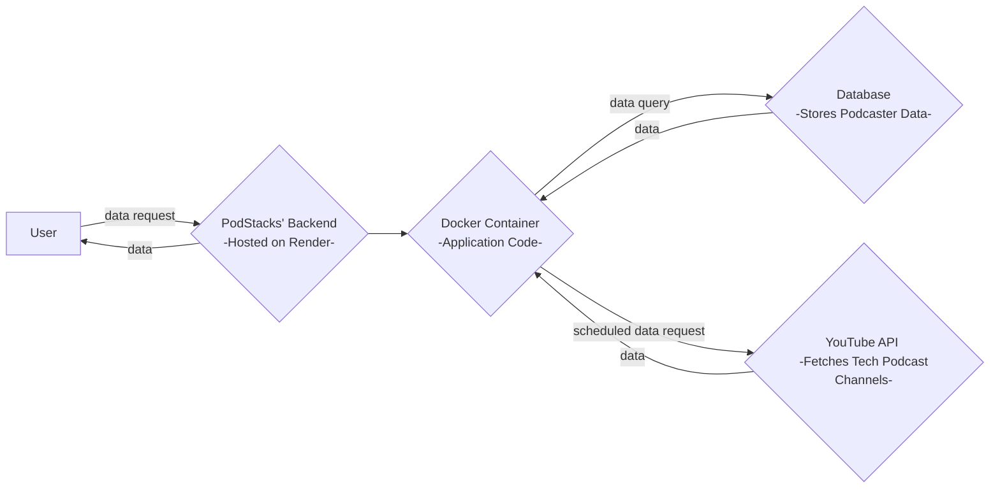

# PodStacks Backend

PodStacks is a backend service designed to curate and maintain a database of the world's most popular tech podcasters using YouTube API. The service runs on **Render** and is containerized with Docker for easy deployment. It is updated monthly with a data pipeline depicted [below](https://github.com/optimak/podstack-backend?tab=readme-ov-file#flow--diagram).

---

## Features

- **YouTube API Integration**: Fetches data on popular tech podcasters on a monthly basis.
- **Automated Database Updates**: Updates the database with the latest information on podcasters.
- **Dockerized Deployment**: Uses Docker for efficient and consistent environment management.
- **Render Hosting**: Deployed on Render for a seamless cloud-hosted backend solution.

---

## Prerequisites

- [Docker](https://www.docker.com/) installed locally
- [Render](https://render.com/) account for deployment
- YouTube API key

---


## Monthly YouTube API Workflow
The backend executes the following workflow every month:

- Authenticate with YouTube API using the provided API key.
- Fetch Popular Tech Podcasters by querying the API for trending tech channels and podcasts.
- Update the Database with the latest channel details and metadata.
- The process is automated using a scheduled job (retrieve_podcasters.py) in node-cron .

## API Endpoint
GET /podcasters
Description: Fetches a list of the top tech podcasters from the database.
Response:
json
```
[
  {
    "name": "Tech Podcaster 1",
    "channel_id": "UC123456789",
    "subscribers": 1000000,
    "videos": 200
  },
  ...
]
```

## Flow  Diagram 



- Data flows from the user request to the backend, where data is processed via the YouTube API, stored in a database, and returned to the user.

